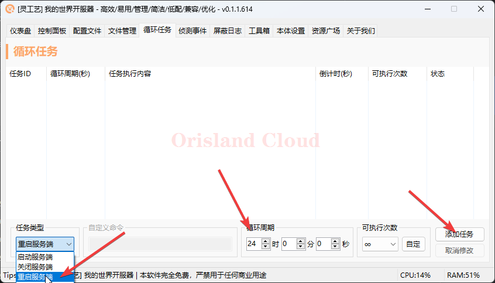

# 开服器配置定时任务

本文面向使用开服器的腐竹。如果你需要该软件方便管理，请看 [kai-fu-qi-tao-ke.md](kai-fu-qi-tao-ke.md "mention")

<figure><figcaption></figcaption></figure>

单机选项卡`循环任务`，将任务类型调整为`重启服务器`，循环周期调整为24小时，单机添加任务。

<figure><figcaption></figcaption></figure>

上方任务列表中出现刚刚添加的计划后，记录这个新增的任务id，如图中为 (1) (1) (1) (1).png>)，具体以实际为准。_<mark style="color:red;">**随后关闭开服器**</mark>_。

<figure><figcaption></figcaption></figure>

前往_**开服器的根目录**_，检查是否有一个文件`LoopTask.json` 如果没有该文件，需要回到上一步重新添加。

<figure><figcaption></figcaption></figure>

检查该目录中是否存在一个文件为图中`定时任务配置.bat` 若不存在，可以在这里下载，下载后解压文件到该文件夹中，确保此时`LoopTask.json` 文件和`restartOnTime.jar` 文件在同一个目录下。



<figure><figcaption></figcaption></figure>

打开`定时任务配置.bat` ，根据你的需要输入数据，下面将以将序号1任务调整到凌晨3点整运行。

请注意脚本给出的修改规范。

<figure><figcaption></figcaption></figure>

修改后，若打开开服器发现倒计时已经不是86400，则修改生效完成。

_<mark style="color:red;">**请注意，本次修改后，如果你关闭了开服务器，上述操作需要重新手操一次。**</mark>_

_<mark style="color:red;">**示例操作完成后，服务器将会在每天3点重启。**</mark>_

<figure><figcaption></figcaption></figure>
