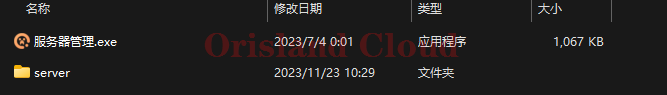
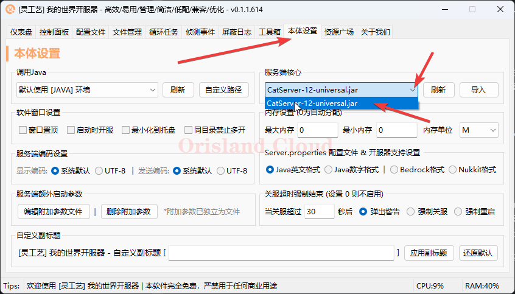
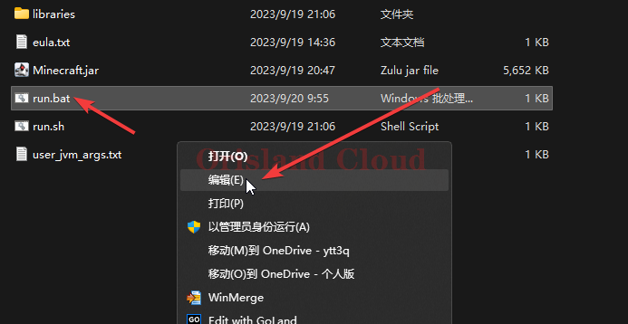
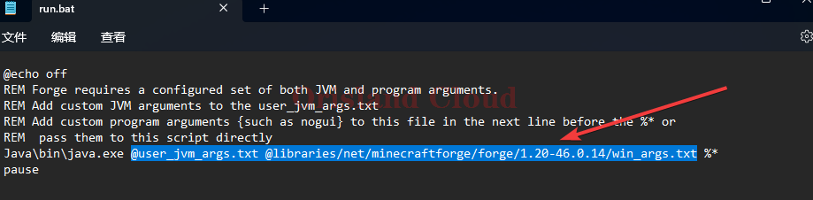

# 开服器套壳

在开始之前，请先准备下面的开服器，用来套壳。



由于不同的版本对应的启动方式不同，下面将教程分为两个部分，可以根据需要进行相关部分的跳转。

对于纯净服务器, farbic, 游戏版本<= 1.16.5的forge，混合式有独立核心(例如 `catserver, mohist, arclight`等)的服务器，请选择 [#fang-fa-1](kai-fu-qi-tao-ke.md#fang-fa-1 "mention")

对于游戏版本> 1.16.5的无独立核心forge，请使用 [#fang-fa-2](kai-fu-qi-tao-ke.md#fang-fa-2 "mention")

## 首先

下载管理工具到本地之后，新建文件夹`server`，将服务端内容拷贝到`server`文件夹中。请注意文件夹名字不要写错，若该文件夹已经存在，可以跳过创建步骤直接把文件放在这个文件夹里。

<figure><figcaption></figcaption></figure>

## 方法1

将服务端复制到`server`后，请寻找<mark style="color:purple;">**真正的服务器核心**</mark>，若该文件夹中只存在唯一一个`jar`文件，可以认为该文件为服务器核心，若该文件夹中存在<mark style="color:red;">**不止一个jar文件**</mark>，请注意识别，真正的核心一般<mark style="color:red;">**不带有**</mark>下面的单词， `installer, minecraft`。

打开开服器，选择本体设置选项卡，将刚才找到的服务器核心选入。

<figure><figcaption></figcaption></figure>

核心配置完成。跳转查看 [#qi-dong-fu-wu-qi](kai-fu-qi-tao-ke.md#qi-dong-fu-wu-qi "mention")

## 方法2

将服务端复制到`server`后，由于高版本的forge服务端没有独立的服务端文件，你可以通过文件夹内是否含有`run.sh，run.bat`，等方式进行鉴别。

&#x20;右击`run.bat`文件，选择编辑，或用任何其他的文本编辑器打开。

<figure><figcaption></figcaption></figure>

请将`@user_jvm_args.txt`到`win_args.txt`的所有字符选择，并进行复制。

<figure><figcaption></figcaption></figure>

## 启动服务器

