# 外部登录

由于微软对离线登录的限制逐渐变多，新版本离线用户已经被限制进行多人游戏。而且由于微软登录服务器的不稳定，即使服务端启动了正版验证，也有可能因为无法稳定链接微软验证服务器而导致登录失败。

此时一个代替方案变得非常必要，所以这里介绍外部登录的使用方法。

本方案的验证站将修改微软为littleskin，一个国内的优秀皮肤站，您也可以自建皮肤站自建登录服务，下面的教程将以littleskin提供的登录验证进行替换。

请注意，_<mark style="color:red;">**外部登录 不等于 正版登录**</mark>_，这种使用外部登录并_<mark style="color:blue;">**不能让你登录真正的正版服务器**</mark>**，**_**外部登录是规避微软正版限制的手段，并不是完全意义上的正版登录，外部登录本质上是另类的离线登录。**

|      | 正版服务器 | 离线服务器 | 外部登录服务器 |
| ---- | ----- | ----- | ------- |
| 正版登录 | ✔     | ✔     | ❌       |
| 离线登录 | ❌     | ✔     | ❌       |
| 外部登录 | ❌     | ✔     | ✔       |

可以单机下面的链接进行快速章节跳转。

[#zhu-ce-yu-jiao-se-chuang-jian](wai-bu-deng-lu.md#zhu-ce-yu-jiao-se-chuang-jian "mention")[#fu-wu-duan](wai-bu-deng-lu.md#fu-wu-duan "mention")[#ke-hu-duan](wai-bu-deng-lu.md#ke-hu-duan "mention")[#yan-zheng-shi-fou-cheng-gong](wai-bu-deng-lu.md#yan-zheng-shi-fou-cheng-gong "mention")

## 注册与角色创建

若已经存在账号则可以跳过该步骤。


littleskin


打开网页后单机注册。

<figure>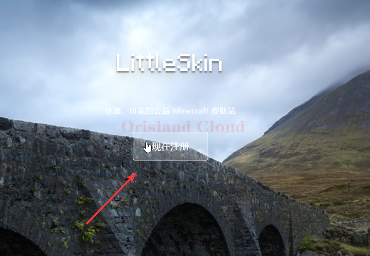<figcaption></figcaption></figure>

正常完成注册后登录。

<figure><figcaption></figcaption></figure>

登录后在左侧单机角色管理，创建角色。

<figure>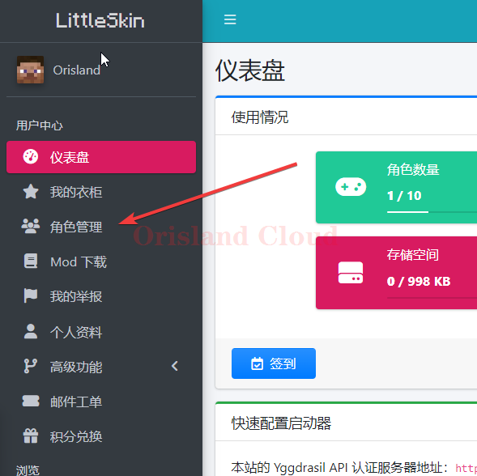<figcaption></figcaption></figure>

<figure>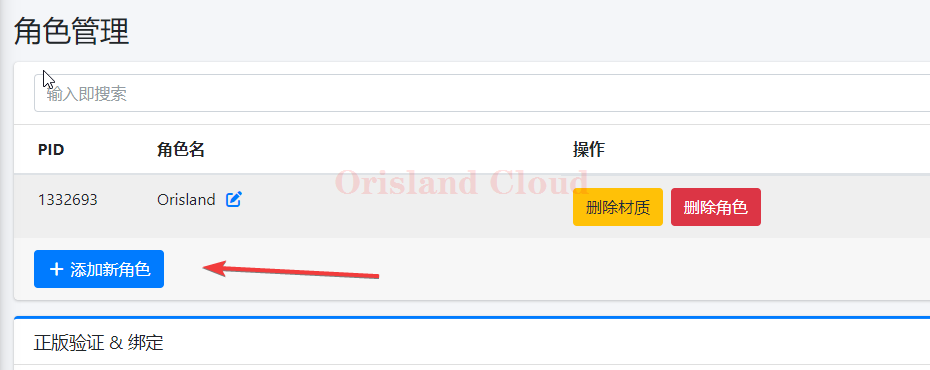<figcaption></figcaption></figure>

<figure><figcaption></figcaption></figure>

添加完成后可以在衣柜里更换皮肤。

<figure>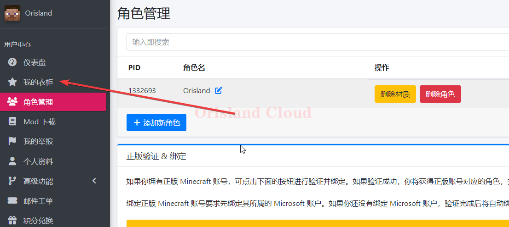<figcaption></figcaption></figure>

## 服务端

服务端需要特殊的配置让外部登录代替正版登录进行验证。

下载外部验证插件，并把该文件放置到服务端根目录，提供两个下载源，以备后续使用，令备注[官方开源wiki](https://github.com/yushijinhun/authlib-injector/wiki)。


gitbook源



蓝奏云


由于外部登录与官方的正版登录类似，所以若要启动外部登录，必须在服务端的server.properties文件中保证online-mode=true。<mark style="color:red;">**若该选项为false，则下面的所有的**</mark>_<mark style="color:red;">**操作均无效**</mark>_，外部登录要求服务端与客户端同时使用，否则任何人都将无法正常登陆(包括正版用户)。

<figure>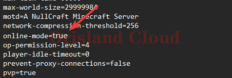<figcaption></figcaption></figure>

> 对于混合式核心（例如arclight，catserver等）；≤1.16.5的forge服务端；fabric服务器，插件服。 [#fang-fa-1](wai-bu-deng-lu.md#fang-fa-1 "mention")，[#kai-fu-qi](wai-bu-deng-lu.md#kai-fu-qi "mention")。

> 对于>1.16.5的forge服务端。
>
> [#fang-fa-2](wai-bu-deng-lu.md#fang-fa-2 "mention")。

### 方法1

修改启动bat，将下面的字符加在java 与 -jar 之间的位置。

`-javaagent:authlib-injector-1.2.1.jar=https://littleskin.cn/api/yggdrasil`

修改样例：

原启动bat文件：

`java -Xms6G -Xmx6G -jar forge.jar nogui`

修改为如下，红色部分为新加部分：

`java -Xms6G -Xmx6G`` `<mark style="color:red;">`-javaagent:authlib-injector-1.2.1.jar=https://littleskin.cn/api/yggdrasil`</mark>` ``-jar forge.jar nogui`

修改完成后保存即可正常启动。

### 方法2

由于高版本forge修改了启动方式，自带了bat文件启动，需要修改的文件为user\_jvm\_args.txt，文件打开后，进行下面的修改，添加上面的那行代码添加到这里并保存，**请注意，新加的部分开头不应该包含#，千万注意，所有#开头的代码均为无效代码。**修改完成后正常启动服务器即可完成服务端的配置。

<figure><figcaption></figcaption></figure>

### 开服器

请在开服器中单机本体设置。

<figure>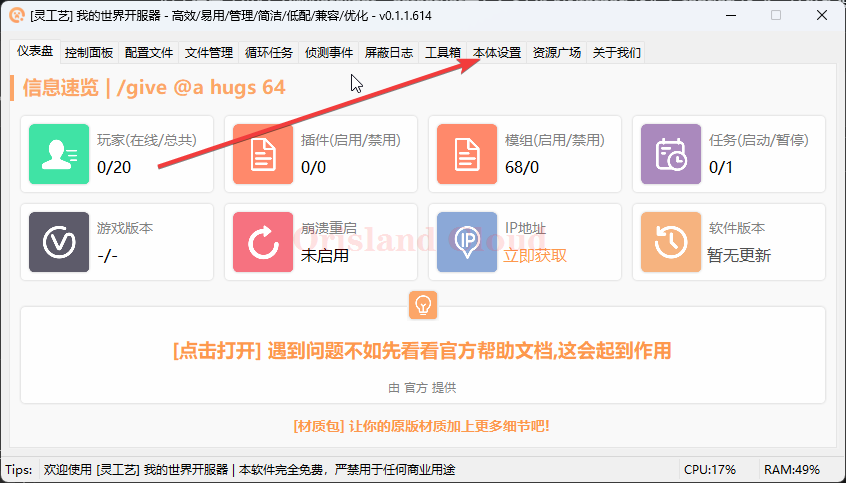<figcaption></figcaption></figure>

单机编辑附加参数文件。

<figure>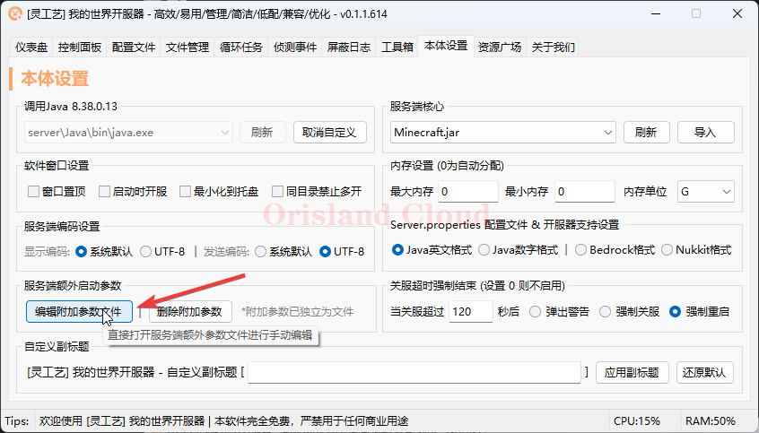<figcaption></figcaption></figure>

在弹出的文本编辑器中添加上面的参数，修改完成后保存。

<figure>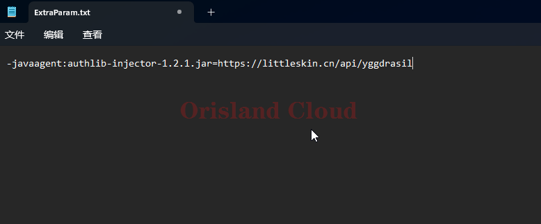<figcaption></figcaption></figure>

保存后后启动服务端即可。

## 客户端

这里以HMCL为例。

请首先准备一个HMCL客户端，没有的话，这边也提供一份下载。


HMCL下载


下面介绍添加客户端的外部验证登录。

单机添加账户。

<figure><figcaption>
创建用户
</figcaption></figure>

单机littleskin登录，并输入账号密码。

<figure>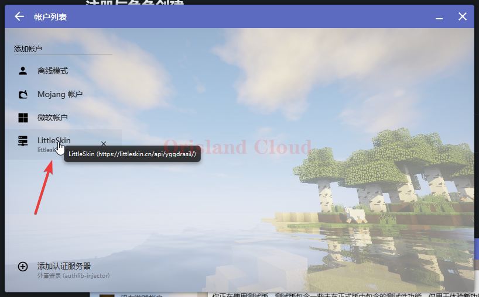<figcaption></figcaption></figure>

输入完成后登录即可，用户名可以使用在皮肤站的起的名称或者邮箱，若您的littleskin创建了多个角色，则在使用邮箱登录的时候，需要选择具体的登录角色。

<figure>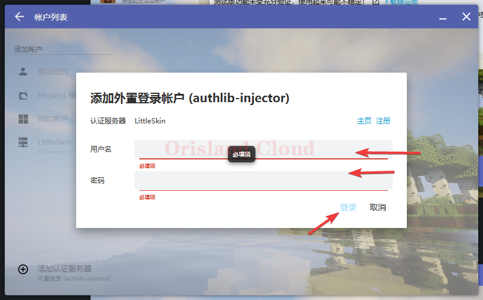<figcaption></figcaption></figure>

登录完成后这里会有角色提示，回到主界面登录即可完成，这些步骤结束后外部登录的客户端方面的操作已经全部完成，原本多人游戏中使用命令登录的步骤省略。

<figure>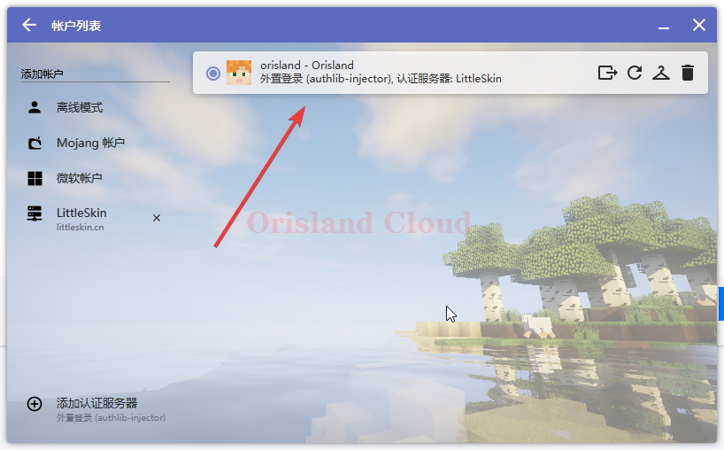<figcaption></figcaption></figure>

## 验证是否成功

服务器在启动时出现如下提示信息，则代表外部登录的服务器配置已完成。

<figure>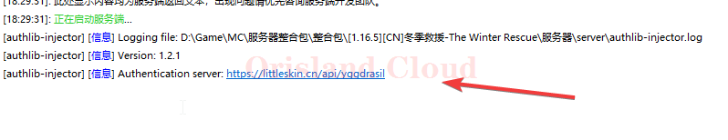<figcaption></figcaption></figure>
