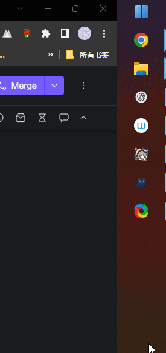
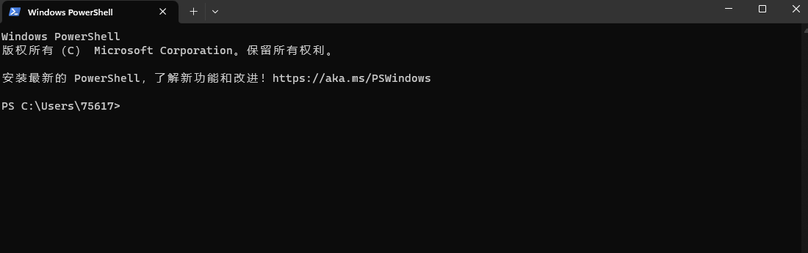

# 制作服务器的启动bat

我的世界最简单的启动命令可以抽象变成这样：🍉  -jar  🍎.jar

🍉🍎都是按需要腐竹自行填入的部分，可以按照需要进行修改和调整，并不固定，就像一个公式一样，需要填入的只有🍉🍎这两个部分。

下面将分别说明这两个图形应该填入什么东西，并将这个抽象的公式变成可执行的命令。

## 🍉

在填入这个命令前，你需要先知道一个表格，根据不同的mc游戏版本，来最终确定这里应该填写的内容。

<table><thead><tr><th width="367" align="center">MC版本</th><th align="center">Java版本</th></tr></thead><tbody><tr><td align="center">≤ 1.16.5</td><td align="center">8</td></tr><tr><td align="center">> 1.16.5</td><td align="center">17</td></tr></tbody></table>

在知道这个表格之后，您还需要知道开服电脑或者服务器安装的java版本，确保匹配对应，请通过下面的gif演示查看系统的java版本。

右击开始菜单，选择Windows终端，单机打开黑框。

<figure><figcaption>
启动控制台
</figcaption></figure>

在黑框中输入java -version 回车查看结果，查看如gif里的数字部分，对比上方的表格辨别java版本是否与mc服务器版本匹配，如果您这里的显示为.png>)，那您需要跳转到Java安装章节或直接转到本节的java版本与游戏不匹配部分查看具体处理方法。

<figure><figcaption>
java版本查看
</figcaption></figure>

若Java版本与游戏版本一致，则🍉部分可以直接填入 `java`，否则指定具体的Java
