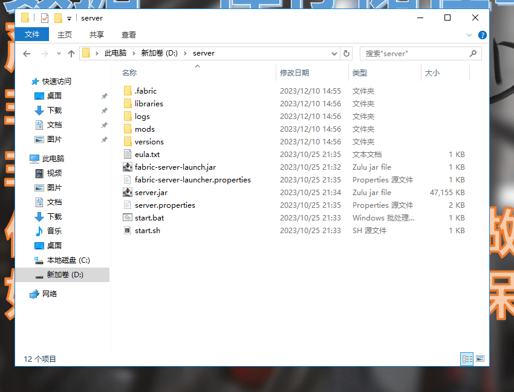
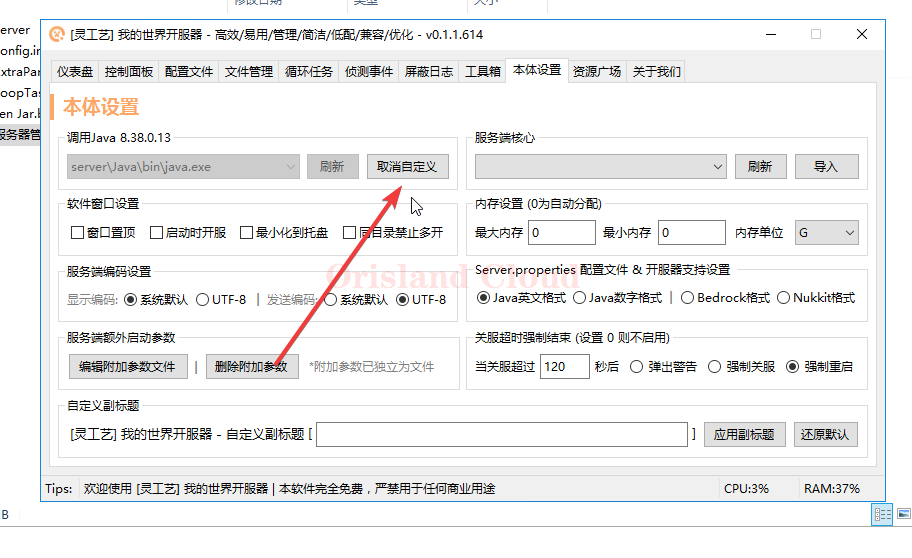
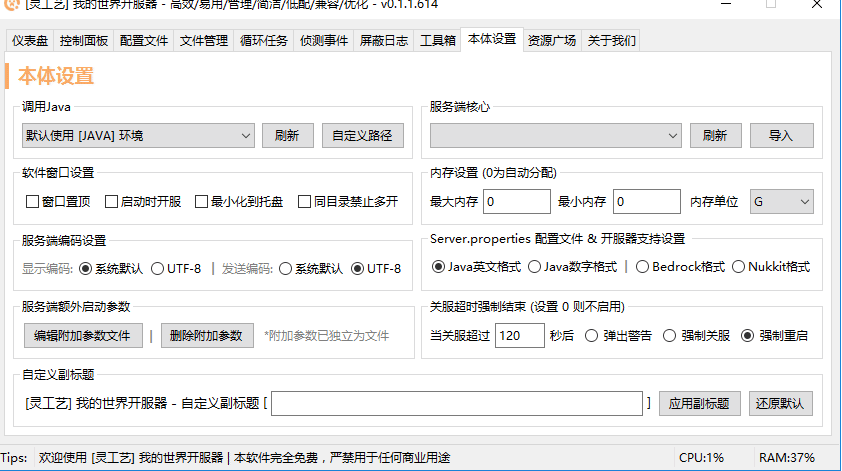
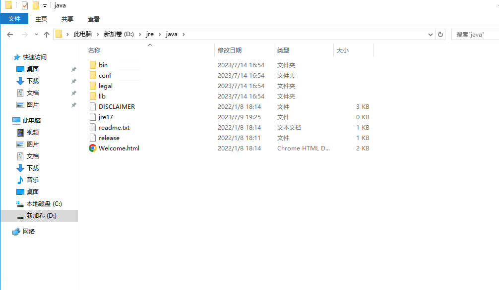
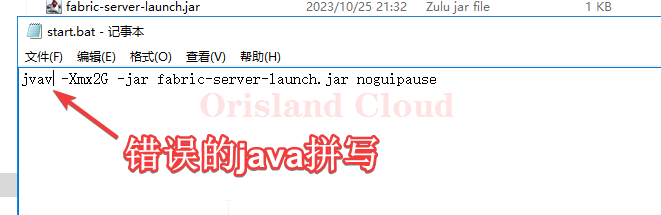
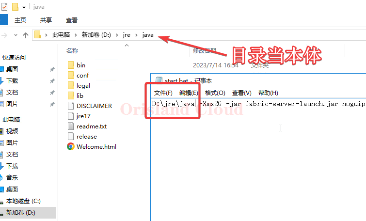

# Java切换

## 一键切换

对于大部分服务端来说，在不额外安装新Java环境的情况下，服务器的Java的环境可以通过下面的方式一键切换8,11,17。您可以在出现的黑窗口中输入所需的java版本后回车，即可调整到响应的Java版本。

<figure><figcaption></figcaption></figure>

## 手动调整

首先明确你到底需要什么版本的Java，下面以需要手动调整到17为例。

编辑启动bat，修改其中的java字符为详细的java路径，下面以fabric 1.20.2，调整为具体D盘已经存在的JDK17路径。_<mark style="color:red;">**注意别忘了添加**</mark>**反斜杠**<mark style="color:red;">**。**</mark>_

<figure><figcaption></figcaption></figure>

## 开服器调整Java路径

打开开服器，打开本体设置。

<figure><figcaption></figcaption></figure>

若开服务器已经默认指定了Java，那么这里可以点取消自定义，若原本就是默认，则可以直接进行下一步。

<figure><figcaption></figcaption></figure>

单机自定义路径，

<figure><figcaption></figcaption></figure>

选择你需要的Java即可。

<figure><figcaption></figcaption></figure>

## 查看目标文件夹下的Java版本

在调整java路径的时候，可能会出现因为命名不当而无法准确获得Java版本的问题，这里给出方法快速的甄别。

打开你需要鉴别的java文件夹，注意该文件夹中应该包含bin文件夹，否则应继续进入更深处的子目录。

使用下面的gif，在命令行输入指令`bin\java -version`即可查看（注意为反斜杠），请注意，在知道这个文件夹中的版本后，如非必要请勿修改文件夹名称，这可能导致`java`环境变量丢失。

<figure><figcaption></figcaption></figure>

## 常见错误排查

在绝大部分情况下，bat或sh启动文件中，java部分都应该以java结尾。

下面的写法均为错误。

### 错误的把java写为jvav。

<figure><figcaption></figcaption></figure>

### java可执行文件错误写为文件夹名（有时可能因重名导致）

<figure><figcaption></figcaption></figure>

<figure><figcaption></figcaption></figure>

另附如何鉴别目录和本体，如果按gif所示粘贴后可以打开文件夹，则错误。

<figure><figcaption></figcaption></figure>

### 正确java的一般位置和表现

exe结尾，文件全名exe。

<figure><figcaption></figcaption></figure>
